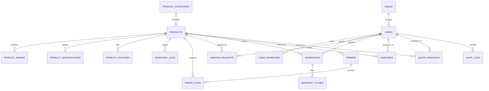

# White Mist Dishwashers - Database Schema & ERD Documentation

## Database Technology
- **RDBMS**: MySQL 8.x
- **Storage Engine**: InnoDB
- **Charset / Collation**: `utf8mb4_unicode_ci`

---

## Entity Relationship Overview & Tables

---

## Relational Schema Definitions

### 1. `roles`
Stores access control roles for system users.
- `id` (INT, PK, AUTO_INCREMENT)
- `name` (VARCHAR(50), UNIQUE, NOT NULL): `'SUPER_ADMIN'`, `'ADMIN'`, `'SALES_STAFF'`, `'SERVICE_STAFF'`, `'CUSTOMER'`
- `description` (TEXT)
- `created_at`, `updated_at` (TIMESTAMP)

### 2. `users`
System customer accounts and staff members.
- `id` (INT, PK, AUTO_INCREMENT)
- `role_id` (INT, FK -> `roles.id`)
- `email` (VARCHAR(255), UNIQUE, NOT NULL, INDEX)
- `password_hash` (VARCHAR(255), NOT NULL)
- `full_name` (VARCHAR(150), NOT NULL)
- `phone` (VARCHAR(30))
- `is_verified` (BOOLEAN DEFAULT FALSE)
- `status` (ENUM('ACTIVE', 'SUSPENDED', 'INACTIVE') DEFAULT 'ACTIVE')
- `created_at`, `updated_at`, `deleted_at` (TIMESTAMP)

### 3. `product_categories`
Categories for commercial and residential dishwashers.
- `id` (INT, PK, AUTO_INCREMENT)
- `slug` (VARCHAR(100), UNIQUE, NOT NULL, INDEX)
- `name` (VARCHAR(100), NOT NULL)
- `description` (TEXT)
- `icon` (VARCHAR(50))
- `is_active` (BOOLEAN DEFAULT TRUE)
- `display_order` (INT DEFAULT 0)
- `created_at`, `updated_at` (TIMESTAMP)

### 4. `products`
Dishwasher appliance inventory.
- `id` (INT, PK, AUTO_INCREMENT)
- `sku` (VARCHAR(50), UNIQUE, NOT NULL, INDEX)
- `model_number` (VARCHAR(50), UNIQUE, NOT NULL)
- `name` (VARCHAR(200), NOT NULL)
- `slug` (VARCHAR(200), UNIQUE, NOT NULL)
- `category_id` (INT, FK -> `product_categories.id`, INDEX)
- `tagline` (VARCHAR(255))
- `short_description` (TEXT)
- `description` (LONGTEXT)
- `price` (DECIMAL(10,2), NOT NULL, INDEX)
- `discount_price` (DECIMAL(10,2))
- `badge` (VARCHAR(50))
- `capacity` (INT COMMENT 'Place settings', INDEX)
- `dimensions` (VARCHAR(100))
- `energy_rating` (VARCHAR(20), INDEX)
- `water_consumption` (DECIMAL(5,1) COMMENT 'Liters per wash')
- `noise_level` (INT COMMENT 'dB level')
- `wash_programs_count` (INT DEFAULT 6)
- `warranty_years` (INT DEFAULT 2)
- `stock_status` (ENUM('IN_STOCK', 'LOW_STOCK', 'OUT_OF_STOCK', 'PRE_ORDER'))
- `available_quantity` (INT DEFAULT 50)
- `reserved_quantity` (INT DEFAULT 0)
- `sold_quantity` (INT DEFAULT 0)
- `status` (ENUM('ACTIVE', 'DRAFT', 'ARCHIVED'))
- `video_url` (VARCHAR(255))
- `rating` (DECIMAL(3,2))
- `reviews_count` (INT)
- `created_at`, `updated_at`, `deleted_at` (TIMESTAMP)

### 5. `product_images`
Product photo gallery and primary thumbnails.
- `id` (INT, PK, AUTO_INCREMENT)
- `product_id` (INT, FK -> `products.id` ON DELETE CASCADE)
- `image_url` (VARCHAR(255), NOT NULL)
- `alt_text` (VARCHAR(255))
- `is_primary` (BOOLEAN DEFAULT FALSE)
- `display_order` (INT DEFAULT 0)

### 6. `product_specifications`
Technical specs per product.
- `id` (INT, PK, AUTO_INCREMENT)
- `product_id` (INT, FK -> `products.id` ON DELETE CASCADE)
- `spec_key` (VARCHAR(100), NOT NULL)
- `spec_value` (VARCHAR(255), NOT NULL)
- `display_order` (INT DEFAULT 0)

### 7. `enquiries`
Customer purchase and information inquiries.
- `id` (INT, PK, AUTO_INCREMENT)
- `enquiry_number` (VARCHAR(30), UNIQUE, NOT NULL)
- `name` (VARCHAR(150), NOT NULL)
- `email` (VARCHAR(255), NOT NULL, INDEX)
- `phone` (VARCHAR(30), NOT NULL)
- `location` (VARCHAR(150), NOT NULL)
- `product_id` (INT, FK -> `products.id` SET NULL)
- `model_number` (VARCHAR(50))
- `message` (TEXT, NOT NULL)
- `preferred_contact_method` (ENUM('PHONE', 'EMAIL', 'WHATSAPP'))
- `status` (ENUM('NEW', 'CONTACTED', 'FOLLOW_UP', 'CONVERTED', 'CLOSED'), INDEX)
- `assigned_staff_id` (INT, FK -> `users.id` SET NULL)
- `internal_notes` (TEXT)
- `created_at`, `updated_at` (TIMESTAMP)

### 8. `quote_requests`
Custom commercial & bulk quote requests.
- `id` (INT, PK, AUTO_INCREMENT)
- `quote_number` (VARCHAR(30), UNIQUE, NOT NULL)
- `product_id` (INT, FK -> `products.id` SET NULL)
- `quantity` (INT DEFAULT 1)
- `customer_name` (VARCHAR(150), NOT NULL)
- `customer_email` (VARCHAR(255), NOT NULL)
- `customer_phone` (VARCHAR(30), NOT NULL)
- `location` (VARCHAR(150), NOT NULL)
- `message` (TEXT)
- `status` (ENUM('PENDING', 'QUOTE_SENT', 'ACCEPTED', 'REJECTED', 'CLOSED'))
- `assigned_staff_id` (INT, FK -> `users.id` SET NULL)
- `created_at`, `updated_at` (TIMESTAMP)

### 9. `service_requests`
Installation, maintenance, repair & support tickets.
- `id` (INT, PK, AUTO_INCREMENT)
- `ticket_number` (VARCHAR(30), UNIQUE, NOT NULL, INDEX)
- `customer_id` (INT, FK -> `users.id` SET NULL)
- `customer_name` (VARCHAR(150), NOT NULL)
- `customer_email` (VARCHAR(255), NOT NULL)
- `customer_phone` (VARCHAR(30), NOT NULL)
- `product_id` (INT, FK -> `products.id` SET NULL)
- `model_number` (VARCHAR(50))
- `serial_number` (VARCHAR(50))
- `service_type` (ENUM('INSTALLATION', 'REPAIR', 'MAINTENANCE', 'WARRANTY_SERVICE', 'TECH_SUPPORT'))
- `problem_description` (TEXT, NOT NULL)
- `address_line` (VARCHAR(255), NOT NULL)
- `city` (VARCHAR(100), NOT NULL)
- `state` (VARCHAR(100), NOT NULL)
- `postal_code` (VARCHAR(20), NOT NULL)
- `preferred_date` (DATE)
- `status` (ENUM('REQUESTED', 'ASSIGNED', 'SCHEDULED', 'IN_PROGRESS', 'COMPLETED', 'CANCELLED'), INDEX)
- `assigned_technician_id` (INT, FK -> `users.id` SET NULL)
- `technician_notes` (TEXT)
- `created_at`, `updated_at` (TIMESTAMP)

### 10. `warranties` & `warranty_claims`
Warranty registrations and claims tracking.
- `id` (INT, PK, AUTO_INCREMENT)
- `warranty_code` (VARCHAR(50), UNIQUE, NOT NULL)
- `customer_id` (INT, FK -> `users.id` SET NULL)
- `product_id` (INT, FK -> `products.id`)
- `model_number` (VARCHAR(50), NOT NULL)
- `serial_number` (VARCHAR(50), UNIQUE, NOT NULL, INDEX)
- `purchase_date` (DATE, NOT NULL)
- `warranty_start_date`, `warranty_end_date` (DATE, NOT NULL)
- `status` (ENUM('ACTIVE', 'EXPIRED', 'VOID', 'CLAIMED'), INDEX)

### 11. `orders` & `order_items`
Ecommerce transaction records with full transactional security.
- `id` (INT, PK, AUTO_INCREMENT)
- `order_number` (VARCHAR(50), UNIQUE, NOT NULL, INDEX)
- `customer_id` (INT, FK -> `users.id` SET NULL)
- `subtotal`, `tax_amount`, `shipping_amount`, `discount_amount`, `total_amount` (DECIMAL(10,2))
- `payment_status` (ENUM('PENDING', 'PAID', 'FAILED', 'REFUNDED'))
- `order_status` (ENUM('PENDING', 'CONFIRMED', 'PROCESSING', 'SHIPPED', 'DELIVERED', 'CANCELLED', 'REFUNDED'), INDEX)
- `shipping_address_json`, `billing_address_json` (LONGTEXT)

### 12. `audit_logs`
Security and administrative audit trail.
- `id` (INT, PK, AUTO_INCREMENT)
- `user_id` (INT, FK -> `users.id` SET NULL)
- `user_email`, `user_role` (VARCHAR)
- `action` (VARCHAR(100), NOT NULL, INDEX)
- `entity` (VARCHAR(100), NOT NULL)
- `entity_id` (VARCHAR(50))
- `metadata_json` (LONGTEXT)
- `ip_address` (VARCHAR(50))
- `created_at` (TIMESTAMP)
